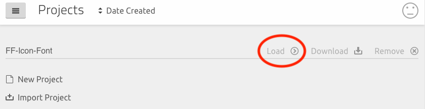

# NUCSSA Icon Font

## How to Use This In New App
Import this font in your root scss file like this:
```css
@import url(https://fonts.nucssa.org/nucssa-icon-font/style.css);
```

You can check the available icons and their codepoints here:
  - [Demo Page](https://fonts.nucssa.org/nucssa-icon-font/demo.html)

## How to Update Icons in the Font
### Regenerate the Project in IcoMoon
You can import `nucssa-icon-font.json` back to the [IcoMoon app](https://icomoon.io/app/#/projects) using the **Import Project** button.
`nucssa-icon-font.json` is located in the root directory of the repo.

### Updating the Project with New Icons
Click on `Load` button to the right of the project entry to open the project.



Explore new icons via the search box at the top. Select the icons that you want to add to our project. And you could import your own svg files to the project too.
Play around with the App, try out all the tools in the toolbar


### Generate the Asset Files That Will Be Uploaded to Our Server
Once finished updating the project, click `Generate Font` at the bottom toolbar to generate the font assets, and then click `Download` to download them to your machine and then we can upload to our server.


Move the downloaded zip file to this repo directory and make sure it is named **_`nucssa-icon-font.zip`_**.

### Save the Project File
Navigate back to the project list (sanwich nav icon -> `Manage Projects`).


And then click `Download` to the project entry.


This will download a `nucssa-icon-font.json` file, move that file to our repo folder, and replace the old file.

---

### Upload Font Assets to Production Server (Ignore this step)
> ## Since we've switched to GitHub Actions for deployment, The following manually deployment step is not needed any more.
**Note**: This operation requires you have access to the productions server via ssh keys. Make sure to add your public key to the server before preceed.
```bash
npm run upload
```
